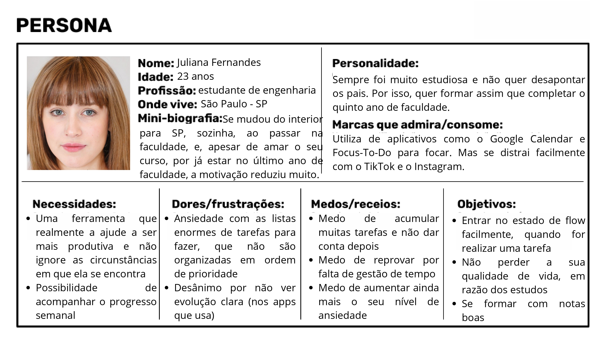

# Web Application Document - Projeto Individual - Módulo 2 - Inteli

**_Os trechos em itálico servem apenas como guia para o preenchimento da seção. Por esse motivo, não devem fazer parte da documentação final._**

## Inflow

#### Alice Devens Carvalho

## Sumário

1. [Introdução](#c1)
2. [Visão Geral da Aplicação Web](#c2)
3. [Projeto Técnico da Aplicação Web](#c3)
4. [Desenvolvimento da Aplicação Web](#c4)
5. [Referências](#c5)

 

## 1. Introdução (Semana 01)

O Inflow, é um sistema web, que tem como objetivo ser um gerenciador de tarefas para organização e produtividade, no qual se preocupa não apenas com a organização das tarefas, mas também com o estado mental da pessoa naquele dia. Assim, ao usuário entrar na aplicação, ele terá que responder um mini questionário sobre como se sente naquele dia, e de acordo com isso, as suas atividades do dia serão adaptadas, de modo que, em dias que a pessoa não esteja tão bem, tarefas mais fáceis sejam atribuídas, e em dias que a pessoa se sinta mais disposta, tarefas mais complicadas/demoradas, sejam feitas. Dessa forma, o intuito dessa aplicação é garantir maior produtividade, porém alinhada com o bem estar mental do usuário.
Além disso, no final de cada semana serão fornecidos dados de produtividade e mensagens motivacionais, que possuam relação com o desenvolvimento da pessoa na semana anterior, e que tentem fazer com que ela se sinta mais encorajada de melhorar cada vez mais nas próximas semanas, ou pelo menos para que mantenha o ritmo.
Para que tudo isso funcione de maneira eficaz, no início da semana o usuário terá que colocar as suas tarefas, com os seus respectivos prazos, níveis de dificuldade e tempo de duração. Com isso, quando a pessoa não se sentir disposta, a aplicação web será capaz de escolher tarefas com níveis de dificuldade e tempo de duração menores, e vice versa.
Portanto, esse sistema web busca gerenciar tarefas de maneira eficaz, unindo produtividade e saúde mental.

---

## 2. Visão Geral da Aplicação Web

### 2.1. Personas (Semana 01)

Personas são personagens fictícios criados com o intuito de representar o cliente ideal para o negócio. Diferentemente do público-alvo, a persona apresenta características específicas e detalhadas, que ajudam a direcionar melhor tanto o desenvolivmento do produto, quanto as campanhas de marketing. Pensando nisso e objetivando uma solução acurada, criei a Juliana Fernandes, que seria a cliente ideal para o Inflow. A seguir, uma imagem que detalha o perfil da Juliana:

    <small><strong style="font-size: 12px;">Persona (Figura 1);</strong></small> 

 <small style="margin-top: 4px; font-size: 10px;">Fonte: Material produzido pela autora (2025)</small>

### 2.2. User Stories (Semana 01)

| Identificação     | US01 - Juliana Fernades                                                                                                                                                                                                                                                                                                                                                                                                                                                                                                                                                  |
| ----------------- | ------------------------------------------------------------------------------------------------------------------------------------------------------------------------------------------------------------------------------------------------------------------------------------------------------------------------------------------------------------------------------------------------------------------------------------------------------------------------------------------------------------------------------------------------------------------------ |
| User Story        | Como uma estudante de engenharia, quero ter a minha agenda organizada, de acordo com os níveis de dificuldade de cada tarefa, para que em dias que eu não esteja me sentindo bem, eu consiga realizar várias tarefas pequenas/fáceis, aumentando o meu senso de realização, e me motivando para estudar para as matérias que não gosto tanto.                                                                                                                                                                                                                            |
| Critérios Investe | **Independente:** organizar a agenda por nível de dificuldade é uma funcionalidade isolada.  **Negociável:** os níveis de dificuldade podem ser ajustados de acordo com a necessidade do cliente. **Valiosa:** cria um equilíbrio entre produtividade e saúde mental. **Estimável:** é possível estimar facilmente o tempo que leva para a criação desses filtros. **Pequena:** organizar os filtros é uma tarefa pequena, que pode ser concluída em uma sprint. **Testável:** testes de usabilidade podem ser feitos para testar se a organização por filtos realmente funciona. |

Identificação | US02 - Renato Lima |
| --- | --- |
User Story | Como um fundador de startup, quero receber relatórios automáticos semanais sobre a minha produtividade, para que eu consiga garantir que os projetos avançem conforme o esperado. |

Identificação | US03 - Rafaela Gomes |
| --- | --- |
User Story | Como uma profissional que lida com ansiedade, quero ter uma maneira simples e intuitiva de organizar as minhas tarefas, para que eu não tenha mais um motivo para ficar ansiosa, e assim, consiga ver claramente o meu progresso semanal, com mensagens motivacionais, caso eu decaia em alguma semana. |

---

## 3. Projeto da Aplicação Web

### 3.1. Modelagem do banco de dados (Semana 3)

    <small><strong style="font-size: 12px;">Diagrama do modelo inicial do banco de dados (Figura 2);</strong></small> 

 <small style="margin-top: 4px; font-size: 10px;">Fonte: Material produzido pela autora (2025)</small>

O diagrama de modelo relacional do banco de dados é utilizado para ajudar a identificar como a informação flui em seu sistema, através do estabelecimento das relações entre os elementos do banco de dados. Assim, através dele é possível representar visualmente as relações entre as entidades (tabelas), e os seus atributos (colunas).
Assim, para entender melhor o motivo das minhas escolhas do meu banco de dados, segue a estrutura de maneira mais detalhada: 

**ENTIDADE: LOGIN**

Objetivo: Armazenar os dados do usuário no sistema 

Atributos: 
 - id: identificador único do usuário, que usa o SERIAL;
 - nome: nome do usuário, utiliza o o tipo VARCHAR;
 - e-mail: e-mail utilizado para realizar o login;
 - senha: senha escolhida pelo usuário para acessar o sistema;

 Relações: 
 - id_usuario na tabela questionario é uma foreign key que referencia o campo id da tabela login. Essa relação 1:N significa que um usuário pode ter acesso a múltiplos questionários (um por dia), mas cada questionário pertence a apenas um usuário.
 - id_login na tabela atividades é uma foreign key que referencia o campo id da tabela login. É uma relação 1:N, pois um usuário pode criar diversas atividades, enquanto cada atividade, pertence a um único usuário.
 

 **ENTIDADE: QUESTIONARIO** 

 Objetivo: armazenar o que o usuário responder em cada questionário.

 Atributos:
 - id: identificador único do questionário, usa o SERIAL;
 - nome: título do questionário, usa o VARCHAR;
 - data: data do preenchimento, usa o TIMESTAMP;
 - id_usuario: foreign key para o login, usa o INT;
 - id_pergunta: foreign key para a entidade das perguntas, usa o INT;

 Relações: 
 - id_usuario na tabela questionario é uma foreign key que referencia o campo id da tabela login. Essa relação N:1 significa que um usuário pode ter acesso a múltiplos questionários (um por dia), mas cada questionário pertence a apenas um usuário.
 - id_pergunta na tabela questionario é uma foreign key que referencia o campo id da entidade perguntas. É uma relação 1:N, porque em um questionário aparece mais de uma pergunta, mas cada pergunta está ligada a apenas um questionário (diário).

**ENTIDADE: PERGUNTAS** 

 Objetivo: armazenar as perguntas usadas no questionário.

 Atributos:
 - id: identificador único das perguntas, usa o tipo SERIAL;
 - texto_perguntas: texto das perguntas, por exemplo: "De 1 a 5, sendo 1 exausto e 5 muito disposto, como você se sente para realizar as suas tarefas hoje?", usa o tipo TEXT.

 Relações: 
 - id_pergunta na tabela resposta é uma foreign key que referencia o campo id da tabela perguntas. É uma relação 1:1, pois cada pergunta tem apenas uma resposta.
 - id_pergunta na tabela questionario é uma foreign key que referencia o campo id da entidade perguntas. É uma relação N:1, porque em um questionário aparece mais de uma pergunta, mas cada pergunta está ligada a apenas um questionário (diário).

 **ENTIDADE: RESPOSTA** 

 Objetivo: armazenar a resposta (avaliação) do usuário às perguntas.

 Atributos:
 - id: identificador único da resposta, usa o SERIAL;
 - id_pergunta: foreign key para a entidade perguntas, usa o INT;
 - avaliacao: valor da resposta/rate, seria o 1 ao 5, do exemplo citado anteriormente, usa o INT.

 Relações: 
 - id_pergunta na tabela resposta é uma foreign key que referencia o campo id da tabela perguntas. É uma relação 1:1, pois cada pergunta tem apenas uma resposta.

 **ENTIDADE: ATIVIDADES** 

 Objetivo: armazenar as tarefas que o usuário precisa realizar na semana.

 Atributos:
 - id: identificador único das atividades, usa o SERIAL;
 - titulo: título da tarefa, utiliza o VARCHAR;
 - descricao: descrição detalhada da tarefa, utiliza o VARCHAR;
 - nivel_dificuldade: o quanto a pessoa considera difícil realizar aquela tarefa, usa o INT;
 - duracao: tempo estimado para concluir a tarefa, usa o INT;
 - prazo: data limite para entregar aquela tarefa, utiliza o DATE;
 - id_login: foreign key para a tabela login, usa o INT.
 - status: se a atividade está como pendente, em desenvolvimento ou concluída, foi utilizado o BOOLEAN.

 Relações: 
 - id_login na tabela atividades é uma foreign key que referencia o campo id da tabela login. É uma relação N:1, pois um usuário pode criar diversas atividades, enquanto cada atividade, pertence a um único usuário.

**LEGENDA:** 
 - SERIAL: para auto incremento dos números inteiros;
 - INT: números inteiros;
 - VARCHAR(): armazena um texto com limite de caracteres, que é definido dentro do parentêses;
 - TEXT: armazena um texto, sem limite de caracteres
 - TIMESTAMP: armazena a data e a hora;
 - DATE: armazena a data.
 - BOOLEAN: armazena valores binários.

O arquivo do modelo físico do banco de dados se encontra <a href="/scripts/init.sql"> aqui! </a>

### 3.1.1 BD e Models (Semana 5)

_Descreva aqui os Models implementados no sistema web_

### 3.2. Arquitetura (Semana 5)

_Posicione aqui o diagrama de arquitetura da sua solução de aplicação web. Atualize sempre que necessário._

**Instruções para criação do diagrama de arquitetura**

- **Model**: A camada que lida com a lógica de negócios e interage com o banco de dados.
- **View**: A camada responsável pela interface de usuário.
- **Controller**: A camada que recebe as requisições, processa as ações e atualiza o modelo e a visualização.

_Adicione as setas e explicações sobre como os dados fluem entre o Model, Controller e View._

### 3.3. Wireframes (Semana 03)

_Posicione aqui as imagens do wireframe construído para sua solução e, opcionalmente, o link para acesso (mantenha o link sempre público para visualização)._

### 3.4. Guia de estilos (Semana 05)

_Descreva aqui orientações gerais para o leitor sobre como utilizar os componentes do guia de estilos de sua solução._

### 3.5. Protótipo de alta fidelidade (Semana 05)

_Posicione aqui algumas imagens demonstrativas de seu protótipo de alta fidelidade e o link para acesso ao protótipo completo (mantenha o link sempre público para visualização)._

### 3.6. WebAPI e endpoints (Semana 05)

_Utilize um link para outra página de documentação contendo a descrição completa de cada endpoint. Ou descreva aqui cada endpoint criado para seu sistema._

### 3.7 Interface e Navegação (Semana 07)

_Descreva e ilustre aqui o desenvolvimento do frontend do sistema web, explicando brevemente o que foi entregue em termos de código e sistema. Utilize prints de tela para ilustrar._

---

## 4. Desenvolvimento da Aplicação Web (Semana 8)

### 4.1 Demonstração do Sistema Web (Semana 8)

_VIDEO: Insira o link do vídeo demonstrativo nesta seção_
_Descreva e ilustre aqui o desenvolvimento do sistema web completo, explicando brevemente o que foi entregue em termos de código e sistema. Utilize prints de tela para ilustrar._

### 4.2 Conclusões e Trabalhos Futuros (Semana 8)

_Indique pontos fortes e pontos a melhorar de maneira geral._
_Relacione também quaisquer outras ideias que você tenha para melhorias futuras._

## 5. Referências

_Incluir as principais referências de seu projeto, para que seu parceiro possa consultar caso ele se interessar em aprofundar. Um exemplo de referência de livro e de site:_ 

---

---
